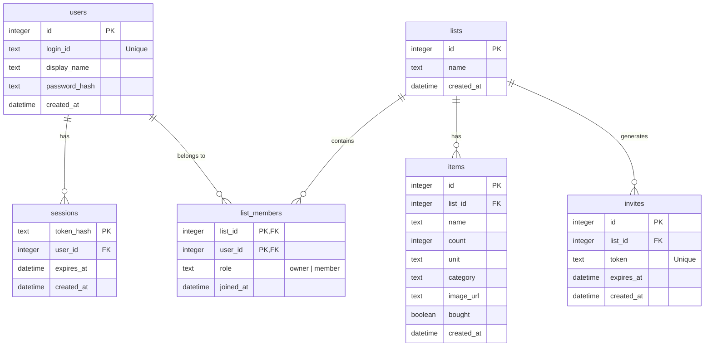

# Entity Relationship Diagram

KauList アプリケーションのデータベース構造です。
Cloudflare D1 (SQLite) を使用しています。

```mermaid
erDiagram
    users ||--o{ sessions : "has"
    users ||--o{ list_members : "belongs to"
    lists ||--o{ list_members : "contains"
    lists ||--o{ items : "has"
    lists ||--o{ invites : "generates"

    users {
        integer id PK
        text login_id "Unique"
        text display_name
        text password_hash
        datetime created_at
    }

    lists {
        integer id PK
        text name
        datetime created_at
    }

    list_members {
        integer list_id PK, FK
        integer user_id PK, FK
        text role "owner | member"
        datetime joined_at
    }

    items {
        integer id PK
        integer list_id FK
        text name
        integer count
        text unit
        text category
        text image_url
        boolean bought
        datetime created_at
    }

    invites {
        integer id PK
        integer list_id FK
        text token "Unique"
        datetime expires_at
        datetime created_at
    }

    sessions {
        text token_hash PK
        integer user_id FK
        datetime expires_at
        datetime created_at
    }
```
